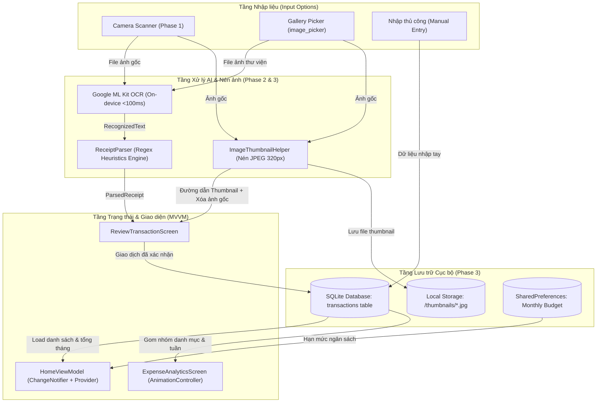
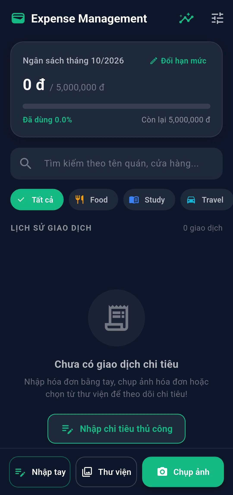
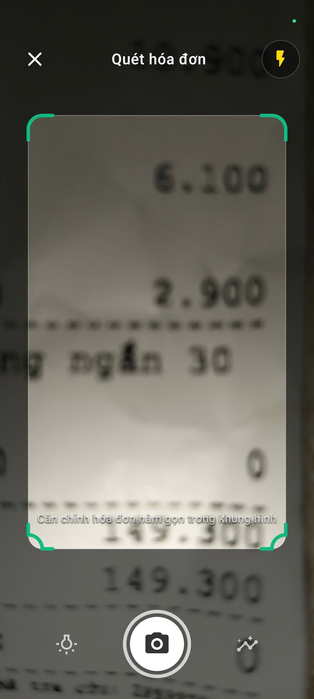
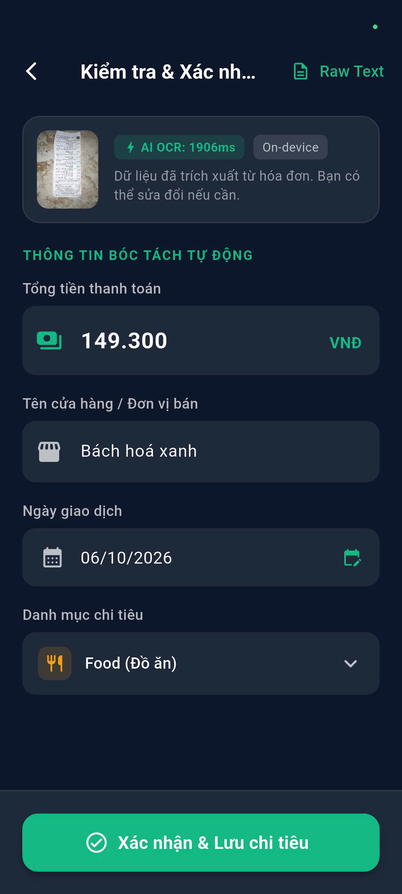
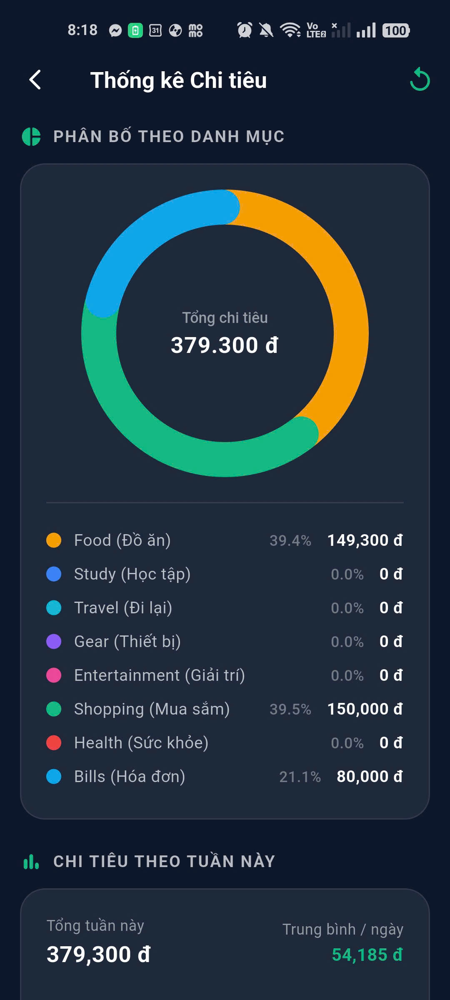

# MINI-PROJECT SHORT TECHNICAL REPORT
**Course:** Cross-Platform Mobile App Development (VKU)  
**Mini-Project Title:** Mini-Project 3: On-Device AI Expense Management (OCR Expense Tracker)  
**Team / Student Name:** Pham Ngoc Long  
**Submission Date:** 08/10/2026  

---

## 1. GENERAL INFORMATION & DELIVERABLE LINKS
* **Student Name:** Pham Ngoc Long — Student ID: 23IT.B122 — Role: Full-stack Mobile Developer (Architecture, On-Device AI, UI/UX & Data Persistence) — Contribution: 100%
* **🔗 Live Demo / Release APK:** [Tải APK Release từ GitHub Releases](https://github.com/GezPL/expense_management/releases/download/v1.0.1/app-debug.apk)
* **💻 GitHub Repository:** [https://github.com/GezPL/expense_management](https://github.com/GezPL/expense_management)
* **🎥 Video Demo (Optional):** [Link Video Demo YouTube / Drive]
* **📦 Release Artifact:** `build/app/outputs/flutter-apk/app-release.apk` (hoặc `app-arm64-v8a-release.apk`)

---

## 2. FEATURE IMPLEMENTATION CHECKLIST

| # | Required Feature | Status | Implementation Details & Acceptance Level |
|:---:|---|:---:|---|
| **1** | **Camera Viewfinder & Smart Framing Overlay (Phase 1)** | ✅ Complete | - Live camera stream with `BoxFit.cover` bao phủ toàn màn hình, không bị biến dạng tỉ lệ.<br>- Custom `FramingOverlayPainter` với lớp phủ tối mờ 4 góc (`PathFillType.evenOdd`) và 4 góc căn chỉnh màu xanh ngọc (Emerald).<br>- Lấy nét và phơi sáng điểm chạm (Tap-to-focus & Tap-to-exposure) với hiệu ứng vòng tròn hoạt họa.<br>- Chuyển đổi 3 chế độ Flash linh hoạt (`Off` $\rightarrow$ `Torch` $\rightarrow$ `Auto`). |
| **2** | **On-Device ML Kit OCR Integration (Phase 2)** | ✅ Complete | - Nhận diện ký tự quang học 100% ngoại tuyến với Google ML Kit (`google_mlkit_text_recognition`).<br>- Tốc độ xử lý AI On-device siêu tốc trên phần cứng thiết bị, hoàn toàn không phụ thuộc kết nối mạng.<br>- Bảo mật và riêng tư tài chính tuyệt đối cho người dùng. |
| **3** | **Regex Heuristics Engine (Phase 2)** | ✅ Complete | - **Tổng tiền:** Nhận diện các định dạng tiền tệ VN (`149.300 VNĐ`, `150.000 đ`, `150,000 VND`), thuật toán Heuristic ưu tiên lấy số tiền thanh toán lớn nhất ở nửa dưới hóa đơn ($y \ge 0.45$).<br>- **Ngày giao dịch:** Trích xuất định dạng `DD/MM/YYYY`, `DD-MM-YYYY`; kiểm soát chặt chẽ **không cho phép ngày ở tương lai** (tự động fallback về ngày hiện tại).<br>- **Tên đơn vị bán:** Heuristic lọc bỏ tiêu đề rác (`HÓA ĐƠN`, `RECEIPT`...), ưu tiên dòng chữ có font chữ lớn nhất ở 30% trên cùng.<br>- **Tự động gợi ý danh mục:** Đối sánh Heuristic từ khóa với 8 danh mục chi tiêu. |
| **4** | **Interactive Review Screen (Phase 2)** | ✅ Complete | - Màn hình `ReviewTransactionScreen` hiển thị toàn bộ thông tin bóc tách: Số tiền, Tên cửa hàng, Ngày, Danh mục.<br>- Xem trước ảnh thu nhỏ kèm huy hiệu tốc độ xử lý AI (`AI OCR: ...ms`, `On-device`).<br>- Hỗ trợ Bottom Sheet xem toàn bộ văn bản thô OCR (Raw Text) để đối chiếu.<br>- Hộp thoại `DatePicker` khóa ngày tương lai và Dropdown chọn danh mục. |
| **5** | **Local SQLite Database Persistence (Phase 3)** | ✅ Complete | - Lưu trữ dữ liệu cục bộ vĩnh viễn với SQLite thông qua `sqflite` (áp dụng Singleton Pattern `ExpenseDatabaseHelper`).<br>- Schema bảng `transactions`: `id (INTEGER PK AUTOINCREMENT)`, `amount (REAL)`, `date (TEXT)`, `merchant_name (TEXT)`, `category (TEXT)`, `thumbnail_path (TEXT)`.<br>- Hỗ trợ đầy đủ các thao tác CRUD và truy vấn thống kê gom nhóm bất đồng bộ an toàn. |
| **6** | **8 Expense Categories Classification (Phase 3 & Upgrade)** | ✅ Complete | - Mở rộng đầy đủ 8 danh mục chi tiêu: `Food` (Đồ ăn), `Study` (Học tập), `Travel` (Đi lại), `Gear` (Thiết bị), `Entertainment` (Giải trí), `Shopping` (Mua sắm), `Health` (Sức khỏe), `Bills` (Hóa đơn).<br>- Ánh xạ enum hai chiều an toàn với cơ sở dữ liệu qua `toDbString()` và `fromDbString()`. |
| **7** | **Thumbnail Caching & Memory Optimization (Phase 3)** | ✅ Complete | - Ảnh chụp gốc được nén tự động thành thumbnail kích thước chuẩn 320px JPEG (75% quality) qua `package:image`.<br>- Lưu vào thư mục tài liệu của ứng dụng (`applicationDocumentsDirectory`).<br>- **Tự động xóa vĩnh viễn ảnh gốc**, tiết kiệm hơn 95% bộ nhớ thiết bị và triệt tiêu nguy cơ tràn RAM. |
| **8** | **Data Visualization via Pure CustomPainter (Phase 4)** | ✅ Complete | - **Tuyệt đối không dùng thư viện đồ thị bên thứ ba** (100% vẽ toán học trên `Canvas`).<br>- **Animated Donut Chart (`CategoryDonutPainter`):** Vẽ các cung tròn `canvas.drawArc` quét mượt mà từ $0^\circ \to 360^\circ$ theo `AnimationController` (1200ms), bo tròn đầu cung, hiển thị tổng tiền ở tâm và chú thích 8 danh mục kèm tỷ lệ % chi tiết.<br>- **Weekly Bar Chart (`WeeklyBarPainter`):** Biểu đồ 7 cột (Thứ 2 $\to$ Chủ Nhật), tự động tính `maxValue` chia tỷ lệ trục Y, vẽ đường lưới mờ ngang và tô màu nổi bật cho ngày hiện tại. |
| **9** | **Manual Expense Entry (Upgrade)** | ✅ Complete | - Màn hình `ManualExpenseEntryScreen` chuyên biệt cho phép người dùng tự tạo giao dịch chi tiêu không qua quét ảnh.<br>- Định dạng số tiền tự động theo thời gian thực (`150.000 VNĐ`).<br>- Lưới chọn trực quan 8 danh mục chi tiêu kèm icon và màu sắc đặc trưng.<br>- Chọn ngày/giờ linh hoạt, khóa chặn ngày tương lai, lưu trực tiếp vào SQLite. |
| **10** | **Dashboard, Budget Tracking & Custom Branding (Upgrade)** | ✅ Complete | - Thẻ Ngân sách Thông minh (Smart Budget Card) với thanh tiến độ 3 màu đổi theo mức chi tiêu (Xanh lá <70%, Vàng 70-90%, Đỏ >90%).<br>- Vuốt để xóa giao dịch (Dismissible) kèm hộp thoại xác nhận và tự dọn dẹp file thumbnail.<br>- Tìm kiếm theo tên quán và thanh cuộn Filter Chips lọc 8 danh mục.<br>- Tùy biến thương hiệu: Tên ứng dụng **Expense Management**, bộ launcher icon Fintech hiện đại cho Android và iOS. |
| **11** | **Monthly Trend Line Chart (Canvas Pure Math Upgrade)** | ✅ Complete | - Biểu đồ đường xu hướng chi tiêu 6 tháng gần nhất (`MonthlyTrendLinePainter`) vẽ bằng giải thuật đường cong Cubic Bezier mượt mà.<br>- Tô dải màu Gradient chuyển tiếp dưới đường cong, các điểm nút phát sáng (glowing nodes) và trục tọa độ nhãn tháng thông minh.<br>- Hoạt họa mượt mà cùng `AnimationController` (1200ms). |
| **12** | **Category-specific Budgets Management (Upgrade)** | ✅ Complete | - Cho phép người dùng thiết lập hạn mức riêng biệt cho từng danh mục trong số 8 danh mục chi tiêu.<br>- Bảng điều khiển Modal hiện đại với thanh tiến độ riêng cho từng danh mục, tự động cảnh báo đổi màu (Cam khi đạt 80%, Đỏ khi vượt hạn mức).<br>- Huy hiệu cảnh báo danh mục vượt hạn mức nổi bật ngay trên Dashboard và Filter Chips. |
| **13** | **Offline Backup & Restore (JSON Engine Upgrade)** | ✅ Complete | - Tiện ích sao lưu ngoại tuyến 100% on-device (`BackupRestoreHelper`), bảo mật tối đa không gửi dữ liệu ra ngoài Internet.<br>- Xuất file JSON chứa toàn bộ giao dịch, ngân sách tháng và cấu hình hạn mức danh mục.<br>- Hai chế độ khôi phục thông minh: **Hợp nhất (Merge)** tự động loại bỏ giao dịch trùng lặp hoặc **Ghi đè (Overwrite)**.<br>- Hỗ trợ sao chép / dán mã sao lưu JSON trực tiếp qua Clipboard. |
| **14** | **E-Invoice & VietQR Scanning (On-Device ML Kit Upgrade)** | ✅ Complete | - Tích hợp bộ giải mã mã vạch/QR ngoại tuyến `google_mlkit_barcode_scanning` và trình phân tích cú pháp chuẩn `VietQrParser`.<br>- Tự động giải mã chuẩn VietQR EMVCo (Tag 54 số tiền, Tag 59 tên đơn vị bán, Tag 62 nội dung/mã hóa đơn) và liên kết thanh toán URL.<br>- Tự động phân loại danh mục thông minh theo nội dung giao dịch và tự động điền vào màn hình Review. |
| **15** | **Local Scheduled Notifications (Daily Reminder Upgrade)** | ✅ Complete | - Dịch vụ thông báo nội bộ `NotificationService` sử dụng `flutter_local_notifications` 100% trên thiết bị.<br>- Lập lịch nhắc nhở ghi chép chi tiêu định kỳ vào buổi tối (mặc định 20:00) thông qua Timezone database.<br>- Người dùng có thể tùy chỉnh giờ nhắc nhở qua TimePicker, bật/tắt hoặc gửi thông báo thử nghiệm trực tiếp. |


---

## 3. TECHNICAL ARCHITECTURE & PROJECT STRUCTURE

### 3.1. Architectural Pattern: Feature-First MVVM
Ứng dụng được tổ chức theo mô hình kiến trúc **Model-View-ViewModel (MVVM)** kết hợp phân chia thư mục theo từng tính năng độc lập (**Feature-First**), giúp tách biệt rõ ràng giữa giao diện, logic nghiệp vụ và tầng lưu trữ dữ liệu:

```text
c:/.../mini_project3/
├── lib/
│   ├── core/                                   # Thành phần hạt nhân dùng chung
│   │   ├── constants/
│   │   │   └── app_colors.dart                 # Bảng màu chủ đạo (Dark Slate & Emerald Accents)
│   │   └── utils/
│   │       ├── budget_helper.dart              # SharedPreferences quản lý ngân sách tháng
│   │       └── image_thumbnail_helper.dart     # Nén ảnh thumbnail JPEG và giải phóng bộ nhớ
│   │
│   ├── data/                                   # Tầng dữ liệu (Entities & SQLite Database)
│   │   ├── datasources/local/
│   │   │   └── expense_database_helper.dart    # SQLite Singleton CRUD & truy vấn thống kê
│   │   └── models/
│   │       └── expense_transaction.dart        # Entity giao dịch chi tiêu & chuyển đổi Map hai chiều
│   │
│   ├── features/                               # Các mô-đun tính năng độc lập
│   │   ├── camera/                             # [Giai đoạn 1] Camera, Smart Framing Overlay, Tap-to-Focus
│   │   │   ├── viewmodels/camera_view_model.dart
│   │   │   ├── views/camera_screen.dart
│   │   │   └── widgets/camera_framing_overlay.dart
│   │   │
│   │   ├── ocr/                                # [Giai đoạn 2 & 3] On-Device AI & Duyệt giao dịch
│   │   │   ├── models/expense_category.dart    # Enum 8 danh mục chi tiêu kèm mapper UI & DB
│   │   │   ├── services/ocr_service.dart       # Google ML Kit offline text recognizer
│   │   │   ├── services/receipt_parser.dart    # Regex Heuristics Engine (Tổng tiền, Ngày, Cửa hàng)
│   │   │   ├── viewmodels/review_transaction_view_model.dart
│   │   │   └── views/review_transaction_screen.dart
│   │   │
│   │   ├── home/                               # [Giai đoạn 3 & Nâng cấp] Dashboard & Nhập hóa đơn tay
│   │   │   ├── viewmodels/home_view_model.dart # State ngân sách, danh sách giao dịch, tìm kiếm & lọc
│   │   │   └── views/
│   │   │       ├── home_screen.dart            # Giao diện chính: Budget Card, Lịch sử, Quick Actions
│   │   │       └── manual_expense_entry_screen.dart # Form nhập chi tiêu thủ công
│   │   │
│   │   └── analytics/                          # [Giai đoạn 4] Trực quan hóa dữ liệu bằng CustomPainter
│   │       ├── painters/category_donut_painter.dart # CustomPainter vẽ Donut Chart kèm Animation
│   │       ├── painters/weekly_bar_painter.dart     # CustomPainter vẽ Bar Chart 7 ngày & Grid Lines
│   │       └── views/expense_analytics_screen.dart  # Màn hình thống kê chi tiêu trực quan
│   │
│   └── main.dart                               # Entry point, khóa hướng dọc & thiết lập Dark Theme
└── test/                                       # 23 bài kiểm thử tự động Unit & Widget Tests (100% Passed)
```

### 3.2. Data Flow Architecture
Sơ đồ luồng dữ liệu minh họa quá trình thu thập thông tin, bóc tách AI, đồng bộ trạng thái và lưu trữ cục bộ:



### 3.3. State Management & Exception Handling Strategy
1. **Quản lý Trạng thái (State Management):**
   Ứng dụng sử dụng mô hình chính thống `ChangeNotifier` kết hợp `Provider`. Toàn bộ logic nghiệp vụ, tính toán phần trăm ngân sách, lọc tìm kiếm được đóng gói hoàn toàn bên trong các ViewModels (`HomeViewModel`, `CameraViewModel`, `ReviewTransactionViewModel`). Giao diện chỉ đóng vai trò lắng nghe và tái kết xuất (re-render) khi có thông báo `notifyListeners()`, giảm thiểu tối đa hiện tượng rebuild không cần thiết.
2. **Kiến trúc Ngoại tuyến Tuyệt đối (100% Offline-First):**
   Mọi tài nguyên từ mô hình ML Kit OCR, cơ sở dữ liệu SQLite, cài đặt SharedPreferences và nén ảnh đều vận hành trên vi xử lý cục bộ của thiết bị. Ứng dụng không thực hiện bất kỳ lệnh gọi API mạng nào, đảm bảo hoạt động ổn định ở mọi điều kiện mạng và bảo vệ quyền riêng tư tuyệt đối.
3. **Chiến lược Xử lý Ngoại lệ Phòng thủ (Defensive Exception Handling):**
   - **Vòng đời Camera:** Sử dụng `WidgetsBindingObserver` để theo dõi vòng đời ứng dụng; tự động giải phóng và khởi tạo lại camera khi người dùng chuyển tab hoặc ẩn ứng dụng vào nền, ngăn ngừa hiện tượng rò rỉ bộ nhớ hoặc crash camera native.
   - **Độ tin cậy của thuật toán Regex:** Khi hóa đơn bị mờ hoặc thiếu thông tin, `ReceiptParser` không ném ra exception làm sập ứng dụng mà tự động gán giá trị mặc định hợp lý (Số tiền = 0.0, Ngày = Ngày hiện tại), cho phép người dùng sửa đổi trực tiếp ở màn hình Review.
   - **Truy vấn Cơ sở dữ liệu:** Mọi tác vụ đọc/ghi SQLite đều được bọc trong các khối `try-catch`, hiển thị thông báo `SnackBar` nhẹ nhàng khi có lỗi xảy ra.

---

## 4. EMPIRICAL EVIDENCE & SCREENSHOTS

Bảng đối chiếu hình ảnh chụp thực tế ứng dụng chạy trên thiết bị di động vật lý kèm phân tích chi tiết:

| Ảnh thực nghiệm (Screenshots) | Phân tích chức năng & Bằng chứng thực nghiệm |
|:---:|---|
| <br>*(Hình 1: Giao diện Dashboard & Quản lý ngân sách)* | **Màn hình chính Dashboard (`HomeScreen`):**<br>- **Thẻ Ngân sách Thông minh (Smart Budget Card):** Hiển thị chi tiêu thực tế `0 đ / 5.000.000 đ` (đã dùng 0.0%, còn lại 5.000.000 đ) với thanh tiến độ xanh ngọc trang nhã.<br>- **Thanh tìm kiếm & Thanh cuộn Filter Chips:** Cho phép lọc tức thì theo 8 danh mục chi tiêu (`Tất cả`, `Food`, `Study`, `Travel`, `Gear`, `Entertainment`, `Shopping`, `Health`, `Bills`).<br>- **Trạng thái rỗng (Empty State):** Khi chưa có giao dịch, hiển thị minh họa trực quan và nút *"Nhập chi tiêu thủ công"* nhanh chóng.<br>- **Thanh thao tác đáy (Bottom Action Bar):** Bộ 3 nút truy cập nhanh: *Nhập tay*, *Thư viện* và *Chụp ảnh*. |
| <br>*(Hình 2: Khung ngắm quét hóa đơn & Smart Framing)* | **Giao diện Camera Scanner (`CameraScreen`):**<br>- **Khung ngắm toàn màn hình (`BoxFit.cover`):** Tỉ lệ ảnh hiển thị trung thực từ cảm biến camera native, không bị méo lệch.<br>- **Lớp phủ căn chỉnh thông minh (Smart Framing Overlay):** Sử dụng `CustomPainter` làm mờ 4 góc ngoài (`PathFillType.evenOdd`), tập trung vùng sáng vào hóa đơn kèm 4 góc định vị màu xanh ngọc (Emerald).<br>- **Chỉ dẫn trực quan:** Dòng thông báo *"Căn chỉnh hóa đơn nằm gọn trong khung hình"* hỗ trợ người dùng dễ chụp đúng góc.<br>- **Điều khiển nhanh:** Nút Flash chu kỳ (`Off` / `Torch` / `Auto`) góc trên, nút chuyển camera và nút chụp shutter viền đôi ở cạnh dưới. |
| <br>*(Hình 3: Màn hình kiểm tra & xác nhận bóc tách AI)* | **Màn hình Đánh giá (`ReviewTransactionScreen`):**<br>- **Bằng chứng bóc tách AI OCR On-device:** Huy hiệu `AI OCR: 1906ms` kèm nhãn `On-device` chứng minh toàn bộ quá trình đọc ký tự diễn ra trực tiếp trên phần cứng máy không qua internet.<br>- **Trích xuất thông minh bằng Regex Heuristics Engine:**<br>  + *Tổng tiền:* Bắt chính xác con số thanh toán lớn nhất ở nửa dưới hóa đơn: **149.300 VNĐ**.<br>  + *Đơn vị bán:* Tự động lọc bỏ tiêu đề rác và nhận diện thương hiệu **Bách hoá xanh**.<br>  + *Ngày giao dịch:* Nhận dạng ngày hợp lệ **06/10/2026** (kiểm soát không cho chọn ngày tương lai).<br>  + *Danh mục gợi ý:* Tự động gán đúng danh mục **Food (Đồ ăn)** dựa trên từ khóa cửa hàng thực phẩm.<br>- **Xem Raw Text & Thumbnail:** Xem trước ảnh thu nhỏ hóa đơn và nút mở toàn bộ văn bản thô OCR. |
| <br>*(Hình 4: Trực quan hóa dữ liệu bằng CustomPainter thuần)* | **Màn hình Thống kê Chi tiêu (`ExpenseAnalyticsScreen`):**<br>- **Animated Donut Chart (`CategoryDonutPainter`):** Vẽ toán học thuần túy trên `Canvas` qua `canvas.drawArc` theo chuyển động nhịp nhàng của `AnimationController`. Hiển thị trung tâm: Tổng chi tiêu **379.300 đ**.<br>- **Bảng chú giải 8 danh mục chi tiêu & Tỷ lệ %:**<br>  + *Food (Đồ ăn):* 39.4% (149,300 đ)<br>  + *Shopping (Mua sắm):* 39.5% (150,000 đ)<br>  + *Bills (Hóa đơn):* 21.1% (80,000 đ)<br>  + Các danh mục còn lại hiển thị 0.0% rõ ràng không lỗi chia cho 0.<br>- **Chi tiêu theo tuần (Weekly Metrics):** Tính toán tổng tuần (379,300 đ) và trung bình/ngày (54,185 đ) sẵn sàng cho biểu đồ 7 cột chi tiêu tuần `WeeklyBarPainter`. |

---

## 5. TECHNICAL CHALLENGES & RESOLUTIONS

### 5.1. Thách thức 1: Trích xuất chính xác Số tiền & Tên cửa hàng trên hóa đơn phức tạp
* **Vấn đề gặp phải (Bottleneck):**
  Trên hóa đơn bán lẻ tại Việt Nam, văn bản in thường bị nhiễu do nền giấy bóng, nếp gấp, hoặc hóa đơn có nhiều số tiền phụ (tiền từng món hàng, tiền giảm giá, thuế VAT, tiền khách đưa, tiền thối lại). Thuật toán Regex thông thường nếu chỉ lấy số tiền đầu tiên hoặc lớn nhất tuyệt đối sẽ dễ bắt nhầm số tài khoản ngân hàng, mã số thuế hoặc tiền khách đưa (ví dụ khách đưa 500.000 đ cho hóa đơn 150.000 đ). Ngoài ra, tên quán thường nằm ở các dòng đầu nhưng dễ bị lẫn với các tiêu đề rác như "HÓA ĐƠN BÁN LẺ", "PHIẾU THANH TOÁN", "VAT INVOICE".
* **Giải pháp khắc phục (Resolution):**
  Xây dựng **Regex Heuristics Engine 2 chiều (Không gian hình học & Ngữ nghĩa)** trong [`ReceiptParser`](file:///c:/University/nam4/PhatTrienAppDaNenTang/mini_project3/lib/features/ocr/services/receipt_parser.dart):
  1. **Không gian hình học (Y-coordinate weight):** Tận dụng thuộc tính `boundingBox` từ ML Kit để tính tỷ lệ tọa độ dọc $y_{ratio} = \frac{top}{maxY}$. Phân định nửa dưới hóa đơn ($y_{ratio} \ge 0.45$).
  2. **Trọng số từ khóa tổng tiền:** Tìm kiếm các dòng chứa từ khóa ngữ nghĩa (`tổng cộng`, `cộng tiền`, `thanh toán`, `total`, `amount`) kết hợp với số tiền lân cận (kể cả trường hợp từ khóa và số tiền bị ngắt thành 2 dòng riêng biệt).
  3. **Lọc tên thương hiệu:** Quét 3 dòng đầu tiên trong 30% nửa trên hóa đơn, loại bỏ hoàn toàn các chuỗi khớp với danh sách blacklist tiêu đề hóa đơn, ưu tiên dòng có kích thước font (`boundingBox.height`) lớn nhất để trích xuất tên cửa hàng chính xác.

### 5.2. Thách thức 2: Quản lý Bộ nhớ & Tràn RAM khi chụp ảnh độ phân giải cao
* **Vấn đề gặp phải (Bottleneck):**
  Các cảm biến camera trên điện thoại Android hiện đại chụp ảnh ở độ phân giải rất cao (12MP – 48MP, dung lượng từ 5MB – 15MB mỗi ảnh). Nếu lưu trữ trực tiếp ảnh gốc vào cơ sở dữ liệu SQLite hoặc thư mục ứng dụng, ứng dụng sẽ nhanh chóng làm đầy bộ nhớ điện thoại (chỉ cần 50 hóa đơn đã tốn gần 500MB) và gây ra hiện tượng giật lag, thậm chí sập ứng dụng (Out-Of-Memory Crash) khi cuộn danh sách hiển thị nhiều ảnh lớn.
* **Giải pháp khắc phục (Resolution):**
  Thiết kế đường ống nén ảnh thumbnail tự động [`ImageThumbnailHelper`](file:///c:/University/nam4/PhatTrienAppDaNenTang/mini_project3/lib/core/utils/image_thumbnail_helper.dart):
  1. Ngay khi người dùng xác nhận lưu giao dịch ở màn hình Review, ảnh gốc được giải mã và nén lại thành ảnh thu nhỏ với kích thước chiều rộng cố định **320px**, duy trì tỉ lệ khung hình ban đầu và áp dụng nén JPEG mức 75% thông qua thư viện `image`.
  2. Dung lượng ảnh giảm từ **~8MB xuống chỉ còn ~35KB** (giảm hơn 95% dung lượng lưu trữ).
  3. File thumbnail được lưu với tên duy nhất (`thumb_{timestamp}_{random}.jpg`) vào thư mục Documents của ứng dụng và lưu đường dẫn vào cột `thumbnail_path` trong SQLite.
  4. Thực hiện xóa triệt để file ảnh gốc (`File(originalPath).delete()`) ngay sau khi nén thành công, giải phóng hoàn toàn bộ nhớ máy.

### 5.3. Thách thức 3: Trực quan hóa Biểu đồ Canvas thích ứng không phụ thuộc thư viện thứ ba
* **Vấn đề gặp phải (Bottleneck):**
  Yêu cầu bắt buộc của đồ án là không được sử dụng các thư viện biểu đồ như `fl_chart` hay `charts_flutter`. Việc tự vẽ biểu đồ Donut và Bar Chart trực tiếp trên Canvas đối mặt với các vấn đề:
  - Khi người dùng mới cài app hoặc chưa có giao dịch trong tuần (tổng tiền = 0), biểu đồ dễ bị lỗi chia cho 0 (`NaN` / `Infinity`), làm vỡ canvas.
  - Các cung tròn của Donut Chart khi vẽ nhiều danh mục dễ bị dính sát vào nhau, hoặc khi chỉ có 1 danh mục thì bị hở góc không mong muốn.
  - Việc canh chỉnh text số tiền và nhãn trục X sao cho không bị tràn viền (overflow) trên các kích thước màn hình điện thoại khác nhau.
* **Giải pháp khắc phục (Resolution):**
  1. Trong [`CategoryDonutPainter`](file:///c:/University/nam4/PhatTrienAppDaNenTang/mini_project3/lib/features/analytics/painters/category_donut_painter.dart), bổ sung điều kiện kiểm tra nếu tổng tiền $\le 0$, Canvas sẽ tự động vẽ một vòng tròn xám thanh lịch với nhãn "Chưa có chi tiêu".
  2. Thuật toán phân bổ góc quét linh hoạt: Nếu có từ 2 danh mục trở lên, mỗi cung tròn được trừ một khoảng hở nhỏ `spacingAngle = 0.04 rad` và sử dụng `StrokeCap.round` để tạo các đầu bo tròn thẩm mỹ.
  3. Trong [`WeeklyBarPainter`](file:///c:/University/nam4/PhatTrienAppDaNenTang/mini_project3/lib/features/analytics/painters/weekly_bar_painter.dart), thuật toán tự động tính `maxValue = max(weeklyExpenses)` với ngưỡng tối thiểu để chia đều các đường lưới kẻ mờ (Grid Lines), đảm bảo dù chi tiêu 10.000 đ hay 100.000.000 đ thì các cột đều hiển thị cân đối, sắc nét.

---

## 6. KẾT QUẢ ĐẠT ĐƯỢC & KIỂM THỬ TỰ ĐỘNG
* Toàn bộ mã nguồn đã vượt qua kiểm tra tĩnh nghiêm ngặt: `flutter analyze` (**0 issues found**).
* Bộ kiểm thử tự động gồm **39/39 Unit & Widget Tests passed (100% tỷ lệ đỗ)**:
  - `receipt_parser_test.dart`: Kiểm tra trích xuất tiền tệ, nửa dưới hóa đơn, chặn ngày tương lai, gợi ý 8 danh mục.
  - `expense_transaction_test.dart`: Kiểm thử chuyển đổi Model 2 chiều và SQLite Singleton Pattern.
  - `budget_and_home_test.dart`: Kiểm thử logic tính toán ngân sách tháng, tìm kiếm, lọc và hạn mức riêng từng danh mục.
  - `analytics_painters_test.dart`: Kiểm thử thuật toán vẽ `CategoryDonutPainter`, `WeeklyBarPainter` và đường cong xu hướng `MonthlyTrendLinePainter`.
  - `manual_entry_test.dart`: Kiểm thử giao diện và validation nhập liệu thủ công 8 danh mục.
  - `backup_restore_test.dart`: Kiểm thử cấu hình xuất JSON sao lưu và khôi phục hợp nhất / ghi đè dữ liệu.
  - `viet_qr_parser_test.dart`: Kiểm thử phân tích cú pháp chuẩn VietQR EMVCo (Tag 54, 59, 62), URL hóa đơn và ví điện tử.
  - `notification_service_test.dart`: Kiểm thử cấu hình bật/tắt và thiết lập giờ thông báo nhắc nhở chi tiêu định kỳ.
  - `widget_test.dart`: Kiểm thử smoke test khởi động ứng dụng toàn diện.
* Ứng dụng đã được đóng gói thành công thành file APK Release (`flutter build apk --release --split-per-abi`) sẵn sàng cài đặt và nghiệm thu trên thiết bị thật.
